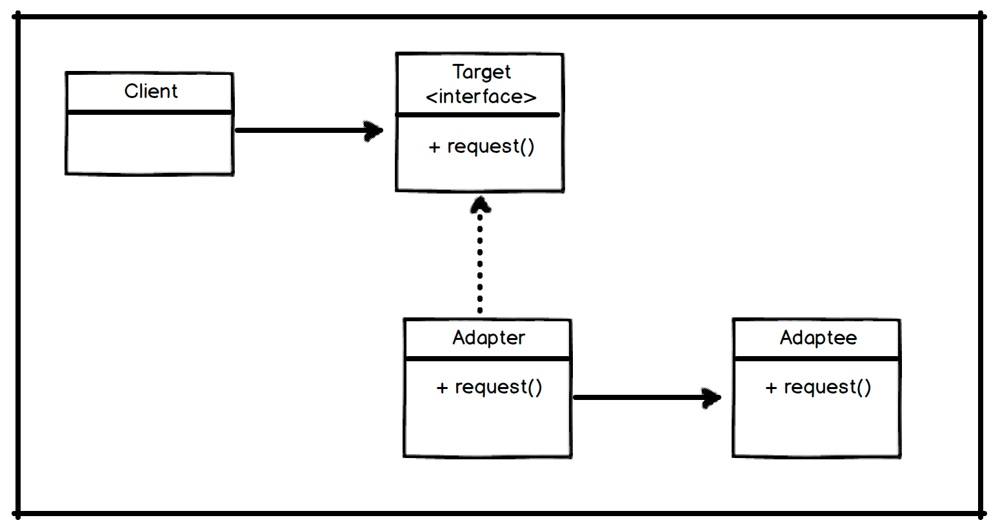

### 1.어댑터 패턴 (Adpater Pattern)
---

- 어댑터 패턴은 ***특정 클래스 인터페이스를 클라이언트에서 요구하는 인터페이스로 변환해주는 패턴***이다.
    - 변환해주는 하나의 어댑터(Adapter)와 어댑터에게 행위를 위임할 하나의 어댑티(Adaptee)가 필요하다.
- 인터페이스를 변환해주는 ***어댑터를 만들면 호환되지 않는 인터페이스를 클라이언트가 요구한 인터페이스로 만들어 줄 수 있다.***

### 2.어댑터 패턴 활용해보기

---

- `java.util.Collection`의 요소를 반환하기 위해서 `Enumeration`와 `Iterator`를 사용한다.
- `Enumeration`은 기존에 사용했던 요소 반환만 존재하는 인터페이스이고 `Iterator`는 `Enumeration`의 기능뿐만 아니라 요소를 제거할 수 있는 기능이 추가된 인터페이스다.
- `Enumeration`은 구형 인터페이스이기 때문에 새로운 인터페이스인 `Iterator`를 사용하기를 원하는 클라이언트의 요구사항이 들어왔다.
- 기존 `Enumeration`를 전부 `Iterator`로 변환하기 보다는 어댑터를 활용하여 `Enumeration` 코드는 건들이지 않고 클라이언트의 요구사항을 쉽게 해결할 수 있다.

- Enumeration
    ```java
    public interface Enumeration<E> {
        boolean hasMoreElements();

        E nextElement();

        //...
    }
    ```
- Iterator

#### 전체적인 구조




- 어댑터 패턴은 지원해야하는 인터페이스의 크기에 따로 코드 작성에 대한 복잡도가 올라간다.
    - 때문에 인터페이스의 크기가 크다면 다른 대안은 없는지 생각해 보아야 한다.
    - 인터페이스의 크기가 크다면 인터페이스의 크기를 먼저 분리해야하는 것은 아닌가에 대한 고민을 하고, 인터페이스를 분리한 이후 어댑터 패턴을 적용시켜도 된다.
    - 모든 인터페이스의 행위에 대해 지원할 필요가 없다면 어댑터를 사용하지 않고 해당 인터페이스를 상속받아 직접 구현하여도 된다.
