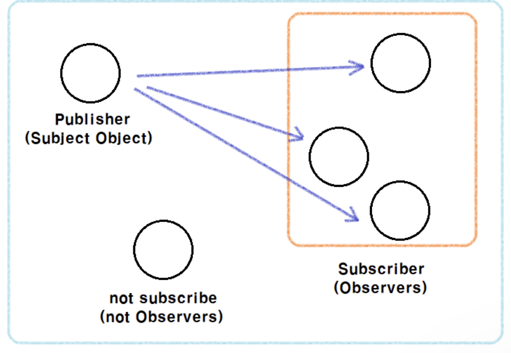

### 1. 옵저버 패턴 (Observer Pattern)
---

- ***객체의 상태가 변경될 때, 해당 객체의 상태를 알고자하는 다른 객체가(Observer) 상태 변화를 감지하고 갱신하는 1:N 방식의 패턴***이다.
- 옵저버 패턴은 2~3개의 주요 인터페이스 및 클래스로 구성되어 있다.
  - 객체의 상태를 저장하는 클래스
  - 객체의 상태를 감지하고 다른 객체(들)에게 정보를 넘겨주는 클래스 `(Subject)`
    - ***상태 변화를 감지해야할 객체들을 추가 및 삭제***할 수 있다.
  - 객체의 상태변화를 감지하여 특정 행위를 하는 클래스 `(Observer)`
  - 객체의 상태를 저장하는 클래스와 Subject는 하나로 묶어서 사용하는 경우도 있다.
- 옵저버 패턴을 사용할 경우 ***`Observer` 들을 추가하거나 삭제할 수 있는 장점***이 있다.


 

### 2. 예시 만들기
---

- 유튜브를 만든 기획자가 영상을 업로드 하면 구독자에게 알람을 주는 서비스를 제작해달고 요청했다고 가정해보자.

#### 2.1. 요구사항에 따른 설계 해보기
- 우리는 요구사항대로 만들기 위하여 설계를 진행할 것이다.
- 영상 데이터를 저장할 클래스
    ```java
    public class Video {

        private String subject;
        private String content;

        public Video(String subject, String content) {
            this.subject = subject;
            this.content = content;
        }

        public String getSubject() {
            return subject;
        }

        public String getContent() {
            return content;
        }
    }
    ```
- 영상이 업로드 될때 구독자에게 영상 업로드 알람을 전달할 유튜브 인터페이스 `(Subject)`
    ```java
    public interface Subject {

        //옵저버 등록
        void registerObserver(Observer observer);

        //옵저버 삭제
        void removerObserver(Observer observer);

        //옵저버들에게 알림
        void notifyObserver();
    }
    ```
- 영상이 업로드 되었을 때 행위를 감지할 구독자 인터페이스 `(Object)`
    ```java
    public interface Observer {
        //영상 상태 변경을 감지하기위한 메서드
        void update(Video video);
    }

    //알람을 보여줄 인터페이스
    public interface Notify {
        void sendNotification();
    }
    ```

#### 2.2 설계에 따른 구현해보기
- 구조를 설계해 보았으니 이제 인터페이스대로 구현 클래스를 제작해보자.
- 유튜브 구현클래스
  - 유튜브 구현 클래스에서는 구독자를 등록 및 삭제할 수 있다.
    - `registerObserver(Observer observer)`, `removerObserver(Observer observer)`
  - 유튜브 구현 클래스에서는 비디오가 업로드가 되면 구독자들에게 알려준다.
    - `uploadVideo(Video video) -> notifyObserver()`
  ```java
  public class Youtube implements Subject{

      private List<Observer> observers = new ArrayList<>();
      private Video video;
      @Override
      public void registerObserver(Observer observer) {
          observers.add(observer);
      }

      @Override
      public void removerObserver(Observer observer) {
          observers.remove(observer);
      }

      @Override
      public void notifyObserver() {
          for (Observer observer : observers) {
              observer.update(video);
          }
      }

      //비디오 업로드시 옵저버들에게 알림
      public void uploadVideo(Video video){
          this.video = video;
          this.notifyObserver();
      }

  }
  ```

- 구독자 구현 클래스
  - 비디오가 업로드 되면 구독자는 알람을 받을 수 있다.
    `Youtube.notifyObserver() -> update(Video video) -> showNotification()`
  - 구독자 클래스를 생성하면 유튜브의 옵저버에 바로 등록이 된다.
    - ` subject.registerObserver(this);`
    - 물론 생성 이후에 등록이 가능하도록 코드로 구현 가능하다.
  ```java
    public class Subscriber1 implements Observer, Notify {

        private String subject = "";
        private String content = "";
        
        //구독자를 생성 시, 유튜브의 옵저버로 등록
        public Subscriber1(Subject subject) {
            subject.registerObserver(this);
        }

        @Override
        public void update(Video video) {
            this.subject = video.getSubject();
            this.content = video.getContent();
            this.showNotification();
        }
        
        //알람 받기
        @Override
        public void showNotification() {
            System.out.println("구독자1에게 업로드된 영상 알람을 보냈습니다.");
            System.out.println("영상 제목 = " + subject  + ", 영상 내용 = " + content);
        }

    }
  ```

#### 2.3. 구독자 알람 서비스 실행해보면서 파악하기

```java
Youtube youtube = new Youtube();
//옵저버 등록
Observer subscriber1 = new Subscriber1(youtube);
Observer subscriber2 = new Subscriber2(youtube);

//영상을 업로드하여 구독자들에게 알림
Video video1 = new Video("제목1", "내용1");
youtube.uploadVideo(video1);

//구독자1 구독 해지
youtube.removerObserver(subscriber1);
System.out.println("================================");

//영상을 업로드하여 구독자들에게 알림
Video video2 = new Video("제목2", "내용2");
youtube.uploadVideo(video2);
```
- 옴저버 패턴을 구현하면서 가장 큰 장점은 ***내가 원하는 대로 옵저버를 등록 및 삭제***가 가능하다.
- 만약 옵저버에게 알려주는 메서드 내에서 구현 클래스로 구현 되어 있다고 생각해보자.
  ```java
  public class Youtube {
      //...
      private Video video;
      @Override
      public void notifyObserver() {
          // for (Observer observer : observers) {
          //     observer.update(video);
          // }
          //구현 클래스에 의존
          new Subscriber1().update(video);
          new Subscriber2().update(video);
      }

      //비디오 업로드시 옵저버들에게 알림
      public void uploadVideo(Video video){
          this.video = video;
          this.notifyObserver();
      }

  }
  ```
  - 만약 위와 같은 방법으로 구현되어 있었다면 ***구독자 등록 및 삭제를 하기위해서는 프로그램을 껐다 켰다를 반복***해야하는 문제가 있다.
  - 뿐만 아니라 ***옵저버 패턴으로 만들어진 코드는 옵저버 클래스를 구현만 한다면 다른 코드를 수정할 일이 없었는데, 위의 코드로 구현했을 때는 옵저버 클래스를 구현하는 것 뿐만아니라 Youtube 클래스도 수정***해야한다.
    - 자주 변경되는 부분을 캡슐화 하라 (분리)
    - 캡슐화한 부분을 추상화하라 (느슨한 결합)
      - 느슨한 결합을 통해서 유튜브 클래스는 어떤 구독자인지 몰라도 된다.
- 옵저버 클래스에는 장점이 있지만 위의 구현에서도 한계가 있다.
  - 바로 ***Video라는 객체 이외에 다른 객체 정보가 들어올 시, 모든 옵저버를 구현한 클래스를 변경해야한다는 단점***이 있다.

### 3. Subject 클래스에서 객체 정보 가져오기
---

- 위의 옵저버 패턴은 일대다 관계에서 옵저버들에게 객체의 상태 변화를 알려주기 위한 좋은 패턴이다. 하지만 문제가 있다. 
- 유튜브에서 영상 뿐만 아니라 뉴스도 추가하여 구독자에게 알람을 보여주는 서비스를 만들어야하는 새로운 요구 사항이 들어왔다고 생각해보자.
  - 그렇게 되면 우리는 옵저버들의 `update(Video video)` 메서드를 `update(Video video, News news)`로 변경하면 되겠지 라고 생각할 것이다.
  - ***만약 계속해서 알람을 알려줘야하는 데이터의 정보가 늘어난다면 어떻게 할 것인가?***
  - 계속해서 `update` 메서드를 수정하면서 `Observer`의 구현클래스들을 수정해 나갈 것인가?
  - update 메서드에 매개변수를 계속해서 추가하는 것은 리팩토링 관점에서도 그리 좋지는 않다.

#### 3.1. 주체로 부터 데이터를 당겨오는 Pull 방식 사용하기

- 기존에 구현했던 옵저버 패턴은 주체가 옵저버에게 데이터를 전달하는 Push 방식이다.
- 알림을 받아야할 데이터가 계속해서 변경되면서, ***주체로 부터 데이터를 당겨오는 Pull 방식***으로 변경해보자.
- 객체의 상태를 저장하는 클래스를 다시 수정해보자.

#### 3.2. 객체의 상태를 저장하는 구현 클래스 만들기

- `Contents`클래스를 만들어 다른 매체 데이터를 저장할 수 있도록 수정한다.
  - 해당 클래스 내부에는 `Video`객체와 `News`객체를 저장할 수 있다. 
    ```java
    public class Contents {
        private Video video;
        private News news;

        public Video getVideo() {
            return video;
        }

        public void setVideo(Video video) {
            this.video = video;
        }

        public News getNews() {
            return news;
        }

        public void setNews(News news) {
            this.news = news;
        }
    }
    ```

#### 3.3 주체 클래스에서 옵저버가 데이터를 가져갈 수 있도록 Getter 메서드 만들기

- 옵저버들이 `Contents` 클래스의 정보를 가져올 수 있도록 Getter 메서드를 만들어준다.
- `notifyObserver()` 메서드를 실행할 때 더이상 데이터를 넘겨주지 않아도 된다.

```java
public class Youtube implements Subject {

    private List<Observer> observers = new ArrayList<>();
    private Contents contents;
    
    //옵저버 등록, 삭제...

    //옵저버에게 알려줄 때, 더이상 객체 정보를 넘겨주지 않아도 된다.
    @Override
    public void notifyObserver() {
        for (Observer observer : observers) {
            observer.update();
        }
    }
    
    public void uploadContents(Contents contents){
        this.contents = contents;
        this.notifyObserver();
    }
    
    //옵저버 구현 클래스에서 해당 데이터 정보를 가져갈 수 있도록 Getter 메서드 만들기
    public Contents getContents() {
        return contents;
    }
}
```

#### 3.4 데이터를 주체에서 받아오도록 옵저버 클래스 구현

- `Observer` 클래스에서는 `Youtube` 클래스에서 정보를 가져와 본인의 역할을 수행할 수 있다.
```java
public class Subscriber1 implements Observer, Notify {

    private Contents contents;
    private Youtube youtube;

    public Subscriber1(Youtube youtube) {
        this.youtube = youtube;
        youtube.registerObserver(this);
    }

    @Override
    public void update() {
        //유튜브 클래스에서 컨텐츠 정보 받아오기
        this.contents = youtube.getContents();
    }

    @Override
    public void showNotification() {
        //알람...
    }
}
```

### 4. 옵저버 패턴 좀더 생각해보기
---

- 옵저버 패턴은 ***소스코드를 작성해야하는 곳 뿐만 아니라 시스템 아키텍쳐에서도 많이 활용***되고 있다.
- 때문에 어떤 시스템을 이해할 때도 아주 중요한 패턴이라고 생각한다.
  - 예를 들어서 어떠한 어떠한 이벤트가 발생되었을때 해당 이벤트 구독자들에게 알려줘야하는 시스템
    - 메시지큐
  - 어떠한 행위를 하였을때 영향을 받을 이벤트 리스너들
    - 버튼 클릭, 탭 변경, 자바스크립트의 이벤트 루프 등등...
- 시스템적인 부분에서도 많이 활용되기 때문에 속도에 대한 생각도 해볼 수 있다.
  - 현재 위의 소스코드에서는 옵저버들에게 알려줄때 하나의 스레드에서 동기 형식으로 실행시키고 있는데, 옵저버들에게 빠르게 알려주기위해서 병렬치리를 하는것을 고려해 볼 수 있다.

### 5. 결론
---

- 옵저버 패턴은 ***객체의 상태가 변경될 때, 해당 객체의 상태를 알고자하는 다른 객체가(Observer) 상태 변화를 감지하고 갱신하는 1:N 방식의 패턴***이다.
- 옵저버 패턴을 도입할 때 먼저 고려해야할 부분은 ***객체의 상태를 저장하는 클래스가 자주 변할지 아닐지를 생각***해보면 좋다.
  - 만약 잘 변경되지 않는 다면 Push 방식
  - 계속해서 변경될 여지가 있다면 Pull 방식
- 옵저버 패턴은 시스템 아키텍처적인 부분에서 많이 활용되고 있기 떄문에 꼭 이해해야 할 패턴중 하나이다.


