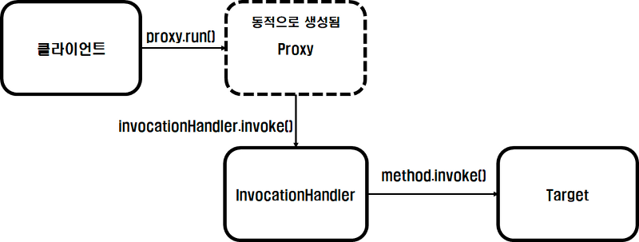

### 1. 프록시 패턴 (Proxy Pattern)
---

- 프록시 패턴은 프록시 행위들을 코드로써 표현한 패턴이다.
    > ***프록시는 대리자, 대변인이라는 뜻이며, 누군가의 일을 대신 처리한다는 의미***이다.
    > - 대변인은 누군가가 지시한 일을 처리한다. == 원래 객체가 하려던 일을 처리한다.
    > - 대변인은 지시받은 일을 어떻게 처리할지 고민하여 처리한다. == 원래 객체가 하던 일에 추가적인 행위를 한다.
- 실제 행위하는 객체를 직접적으로 참조하는 것이 아닌 ***실제 객체를 대변하는 프록시 객체를 통해 대상 객체에 접근하는 방식을 사용***한다.
  - 프록시 객체 내부에서 실제 객체일을 처리하기 때문에 프록시 객체 내부에 진짜 객체 정보를 참조하거나 설정해야한다. 
  - 실제 행위를 하는 객체가 메모리에 존재하지 않아도 기본적인 정보를 참조하거나 설정할 수 있다.
- ***프록시 객체가 실제 객체의 행위에 부가적인 기능을 설정***할 수 있다.
  - 생성 시간이 오래 걸리는 실제 객체의 상태를 보관하여 재사용할 수 있다. (캐싱) 
  - 실제 객체가 하는 일에 대해 접근 제어도 가능하다. (접근 제어) 
  - 실제 객체의 기능이 필요한 시점까지 객체의 생성을 미룰 수 도 있다.
  > 여기서 핵심은 실제 객체의 행위자체에 대해서 프록시 객체가 침범해서는 안된다.


### 2. 프록시 만들어보기
---

- 모든 메서드가 걸리는 시간에 대해서 알고싶다는 요구사항이 들어왓다고 가정해보자.

#### 2.1. 모든 코드에 구현해보기
```java
public class MemberServiceImpl implements MemberService{
    @Override
    public void join(String id) {

        long startTime = System.currentTimeMillis();
        System.out.println(id + "이 회원가입하였습니다.");
        try {
            Thread.sleep(1000);
        } catch (InterruptedException e) {
        }

        long endTime = System.currentTimeMillis();
        System.out.println(endTime - startTime + "ms");
    }

    @Override
    public void delete(String id) {
        long startTime = System.currentTimeMillis();
        System.out.println(id + "이 탈퇴하였습니다.");
        try {
            Thread.sleep(1000);
        } catch (InterruptedException e) {
        }

        long endTime = System.currentTimeMillis();
        System.out.println(endTime - startTime + "ms");
    }
}
```
- `MemberService`에 대한 모든 메서드에 시간을 알기위해서 모든 회원 가입과 탈퇴로직에 전부 추가했다.
- 만약 부가적인 로직들이 추가될때 마다 `MemberService`에 작성한다고 생각해보자.
- 무수히 많은 코드 중복이 일어날것이고 점점 실제 하는 행위에 대한 코드가 눈에 들어오지 않는 지경에 이르게 될 것이다.
<br/><br/>

#### 2.2. 부가 로직만 따로 역할 분리해보기
```java
public class MemberServiceImpl implements MemberService {

    public static class TimeChecker<T>{
        public T check(Supplier<T> supplier){
            long startTime = System.currentTimeMillis();
            T result = supplier.get();
            long endTime = System.currentTimeMillis();
            System.out.println(endTime - startTime + "ms");
            return result;
        }
    }

    @Override
    public void join(String id) {

        TimeChecker<Object> timeChecker = new TimeChecker<>();
        timeChecker.check(() -> {
            System.out.println(id + "이 회원가입하였습니다.");
            try {
                Thread.sleep(1000);
            } catch (InterruptedException e) {
            }
            return null;
        });
    }

    @Override
    public void delete(String id) {

        TimeChecker<Object> timeChecker = new TimeChecker<>();
        timeChecker.check(() -> {
            System.out.println(id + "이 탈퇴하였습니다.");
            try {
                Thread.sleep(1000);
            } catch (InterruptedException e) {
            }
            return null;
        });
    }
}
```
- `MemberService`내에 `TimeChecker` 정적 클래스를 만들어서 메서드 실행시간을 구하는 로직을 따로 분리해보았다.
- 코드 중복도 사라지고 꽤 괜찮은 코드라고 생각할 수 있지만 문제가 있다.
  - `TimeChecker` 클래스를 생성하여 모든 메서드에 감싸주어야 한다.
  - `MemberService`내에 있는 코드를 계속해서 수정해야한다. (실수 발생 가능성이 높다.)
  - `TimeChecker` 기능을 제외한 `MemberService` 만의 기능을 다른 곳에서 사용하고자 할때 사용할 수 없다. 
<br/><br/>

#### 2.3. 부가로직을 프록시로 만들어보기
- 전체적인 구조
    

- 코드 작성
    - MemberService
        ```java
        public class MemberServiceImpl implements MemberService {

            @Override
            public void join(String id) {
                System.out.println(id + "이 회원가입하였습니다.");
                try {
                    Thread.sleep(1000);
                } catch (InterruptedException e) {
                }

            }

            @Override
            public void delete(String id) {
                System.out.println(id + "이 탈퇴하였습니다.");
                try {
                    Thread.sleep(1000);
                } catch (InterruptedException e) {
                }
            }
        }
        ```
    - MemberServiceProxy
        ```java
        public class MemberServiceProxy implements MemberService {

            private final MemberService memberService;
            public MemberServiceProxy(MemberService memberService) {
                this.memberService = memberService;
            }

            public static class TimeChecker<T>{
                public T check(Supplier<T> supplier){
                    long startTime = System.currentTimeMillis();
                    T result = supplier.get();
                    long endTime = System.currentTimeMillis();
                    System.out.println(endTime - startTime + "ms");
                    return result;
                }
            }

            @Override
            public void join(String id) {

                TimeChecker<Void> timeChecker = new TimeChecker<>();
                timeChecker.check(() -> {
                    memberService.join(id);
                    return null;
                });
            }

            @Override
            public void delete(String id) {
                TimeChecker<Void> timeChecker = new TimeChecker<>();
                timeChecker.check(() -> {
                    memberService.delete(id);
                    return null;
                });
            }
        }
        ```
- `MemberService`가 내에서 시간을 측정하는 코드 작성과 역할을 `MemberServiceProxy`가 대신 하고 있다.
- 부가 기능에 대한 로직 수정, 삭제, 추가를 `MemberService`가 아닌 `MemberServiceProxy`에서 하게되어 더이상 `MemberService`의 코드를 수정할 필요가 없다.
- 기존에는 `MemberSerivce`내에 실제 기능과 부가기능이 함께 있기 때문에 `MemberSerivce`만의 기능을 활용하기 힘들었지만 부가 기능은 프록시를 통해서 이용하기 때문에 `MemberSerivce`의 실제 기능도 사용할 수 있게 되었다.
- 프록시 패턴을 활용하여 좀 더 나은 기능을 만들어 보았지만 이 코드에서도 문제점이 있다.
  - 만약 다른 서비스 코드에서도 시간을 재는 로직이 필요할 경우 계속해서 프록시를 만들어주어야한다.
  - ***코드 중복이 지속적으로 일어날 수 있기 때문에 `동적 프록시`를 활용하여 해당 문제를 해결***해보자.
<br/><br/>

#### 2.4. 동적 프록시를 활용하여 부가로직 작성해보기

- 동적 프록시와 필요성
  - 위에서 여러 서비스에 모든 시간 측정 프록시를 만들게 되었을 때 어떤 문제가 있었는가?
    - 모든 서비스의 프록시를 만들어 주어야 한다.
    - 서비스의 메서드별로 시간 측정 코드가 중복적으로 발생한다.
  - 컴파일 시점에는 이미 정해진 코드 내에서 프로그램이 돌아가기 때문에 위의 문제를 해결하기가 힘들다.
  - 이 문제를 해결하기 위해서는 ***런타임 시점에 클래스의 타입과 각 메서드에 구애받지 않고 활용할 수 있는 프록시***를 만들어야한다.
    - ***런타임 시점에 프록시 클래스를 만들어주는 방식을 동적 프록시***라고 한다.
  - `java.lang.reflect` 패키지 내에서 동적 프록시를 만들 수 있는 기능들이 내장되어 있으며 해당 기능을 활용하여 런타임 시점에 코드를 조작할 수 있다.

- 전체적인 구조
  - 
- 코드 작성
  - InvocationHandler
    ```java
    public class TimeCheckerInvocationHandler implements InvocationHandler {

        private Object service;
        public TimeCheckerInvocationHandler(Object service) {
            this.service = service;
        }

        //실제 service의 메서드 실행 뿐만 아니라, 시간을 측정하는 부가로직도 들어가 있다.
        @Override
        public Object invoke(Object proxy, Method method, Object[] args) throws Throwable {

            long startTime = System.currentTimeMillis();
            
            //InvocationHandler가 실제 클래스의 메서드를 실행한다.
            Object invoke = method.invoke(service, args);
            
            long endTime = System.currentTimeMillis();
            System.out.println(endTime - startTime + "ms");
            return invoke;
        }
    }
    ```
  - Proxy
    ```java
    //invocationHandler 생성
    TimeCheckerInvocationHandler timeCheckerInvocationHandler = new TimeCheckerInvocationHandler(new MemberServiceImpl());
    //Proxy 만들기
    MemberService memberService = (MemberService) Proxy.newProxyInstance(MemberService.class.getClassLoader(),
            new Class[]{MemberService.class},
            timeCheckerInvocationHandler);
    //Proxy 메서드 실행
    memberService.join("id");
    ```
- `InvocationHander`와 `Proxy`를 통해서 시간측정을 하는 코드 중복을 줄였을 뿐만 아니라, 모든 서비스의 프록시를 직접 만들 일도 없어졌다.
- InvocationHandler 인터페이스
    ```java
    package java.lang.reflect;
        
        public Object invoke(Object proxy, Method method, Object[] args)
            throws Throwable;
    }
    ```
    - 프록시 인스턴스의 메서드를 호출하게 될 경우 실행하게 되는 핸들로이다.
    - 프록시 인스턴스, 실제 인스턴스의 메서드를 호출할 수 있는 메서드 인스턴스, 인자값을 통해서 부가 로직 뿐만 아니라 실제 인스턴스의 메서드를 호출할 수 있다.
- Proxy 클래스
    ```java
    package java.lang.reflect;

    //import ...

    public class Proxy implements java.io.Serializable {
        //...
        @CallerSensitive
        public static Object newProxyInstance(ClassLoader loader,
                                            Class<?>[] interfaces,
                                            InvocationHandler h) {
                                                //...
                                            }
    }
    ```
    - `Proxy.newProxyInstance()` 정적 메서드를 활용하여 클래스를 생성할 수 있다.
    - 클래스 로더, 프록시에서 구현해야하는 인터페이스, 호출 핸들러인 `InvocationHandler`의 정보를 통해서 프록시를 생성한다.
- 실제로 동적 프록시를 통해 인스턴스를 생성하다 보면 해당 타입이 변경되었다는 것을 디버깅을 통해서 확인할 수 있다.
  - `$Proxy, [클래스명]$$EnhancerBySpringCGLIB$$[해시코드]`
- 동적 프록시를 활용한 코드 조작은 스프링 내부에서 많이 사용하고 있으며, 동적 프록시를 이해하는 것이 스프링의 동작 방식을 이해하는 것에 도움이 될 수 있다.
  - AOP, CGLIB를 활용한 프록시 클래스 생성 등등...

### 3. 프록시 패턴에 대해서 생각해보기
- 프록시 패턴은 실제 행위하는 객체를 직접적으로 참조하는 것이 아닌 ***실제 객체를 대변하는 프록시 객체를 통해 대상 객체에 접근하는 방식***이다.
- 프록시 패턴을 활용하면 ***기존 코드를 수정하지 않고 부가 로직을 확장할 수 있는 패턴***이다.
  - OCP
- 소스코드를 작성해야하는 곳 뿐만 아니라 시스템 아키텍쳐에서도 많이 활용되고 있기 때문에 어떤 시스템을 이해할 때도 아주 중요한 패턴이라고 생각이 된다.
  - 포워드 프록시(forward proxy)와 리버스 프록시(reverse proxy)
- 일단 소스코드 작성에 대해서만 생각해보면 단일 클래스에 대한 특정 행위에 대해서 프록시를 만드는 것은 한번 고민을 해봐야 한다.
- 프록시는 단일 클래스를 위해서 사용하기에는 코드 복잡도가 올라가기 때문에 일부분 또는 전체적인 부분을 수정하기위해서 만드는 것이 훨씬 효과적인 패턴일 수 있다.
- 항상 소스코드를 작성할 때는 내가 왜 이렇게 디자인 해야하는지에 대한 어느정도의 이유를 생각해보고 작성하는 것이 좋다.


> Spring AOP의 메커니즘과 Proxy Bean 생성: https://gmoon92.github.io/spring/aop/2019/02/23/spring-aop-proxy-bean.html