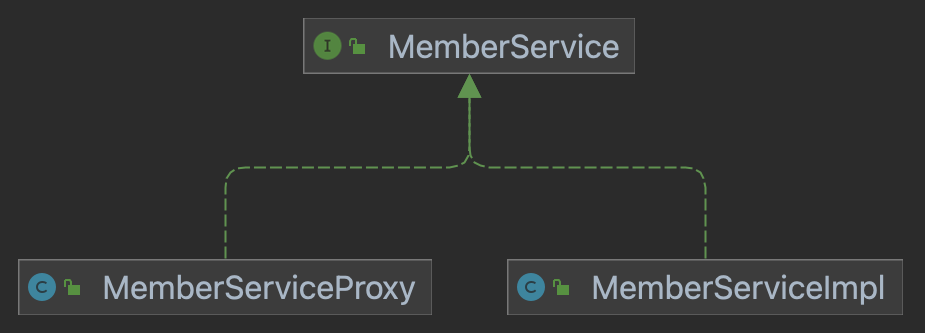

### 프록시 패턴 (Proxy Pattern)
---

- 프록시 패턴은 프록시 행위들을 코드로써 표현한 패턴이다.
    > ***프록시는 대리자, 대변인이라는 뜻이며, 누군가의 일을 대신 처리한다는 의미***이다.
    > - 대변인은 누군가가 지시한 일을 처리한다. == 원래 객체가 하려던 일을 처리한다.
    > - 대변인은 지시받은 일을 어떻게 처리할지 고민하여 처리한다. == 원래 객체가 하던 일에 추가적인 행위를 한다.
- 실제 행위하는 객체를 직접적으로 참조하는 것이 아닌 ***실제 객체를 대변하는 프록시 객체를 통해 대상 객체에 접근하는 방식을 사용***한다.
  - 프록시 객체 내부에서 실제 객체일을 처리하기 때문에 프록시 객체 내부에 진짜 객체 정보를 참조하거나 설정해야한다. 
  - 실제 행위를 하는 객체가 메모리에 존재하지 않아도 기본적인 정보를 참조하거나 설정할 수 있다.
- ***프록시 객체가 실제 객체의 행위에 부가적인 기능을 설정***할 수 있다.
  - 생성 시간이 오래 걸리는 실제 객체의 상태를 보관하여 재사용할 수 있다. (캐싱) 
  - 실제 객체가 하는 일에 대해 접근 제어도 가능하다. (접근 제어) 
  - 실제 객체의 기능이 필요한 시점까지 객체의 생성을 미룰 수 도 있다.
  > 여기서 핵심은 실제 객체의 행위자체에 대해서 프록시 객체가 침범해서는 안된다.


### 프록시 만들어보기
---

- 모든 메서드가 걸리는 시간에 대해서 알고싶다는 요구사항이 들어왓다고 가정해보자.

#### 1. 모든 코드에 구현해보기
```java
public class MemberServiceImpl implements MemberService{
    @Override
    public void join(String id) {

        long startTime = System.currentTimeMillis();
        System.out.println(id + "이 회원가입하였습니다.");
        try {
            Thread.sleep(1000);
        } catch (InterruptedException e) {
        }

        long endTime = System.currentTimeMillis();
        System.out.println(endTime - startTime + "ms");
    }

    @Override
    public void delete(String id) {
        long startTime = System.currentTimeMillis();
        System.out.println(id + "이 탈퇴하였습니다.");
        try {
            Thread.sleep(1000);
        } catch (InterruptedException e) {
        }

        long endTime = System.currentTimeMillis();
        System.out.println(endTime - startTime + "ms");
    }
}
```
- `MemberService`에 대한 모든 메서드에 시간을 알기위해서 모든 회원 가입과 탈퇴로직에 전부 추가했다.
- 만약 부가적인 로직들이 추가될때 마다 `MemberService`에 작성한다고 생각해보자.
- 무수히 많은 코드 중복이 일어날것이고 점점 실제 하는 행위에 대한 코드가 눈에 들어오지 않는 지경에 이르게 될 것이다.

#### 2. 부가 로직만 따로 역할 분리해보기
```java
public class MemberServiceImpl implements MemberService {

    public static class TimeChecker<T>{
        public T check(Supplier<T> supplier){
            long startTime = System.currentTimeMillis();
            T result = supplier.get();
            long endTime = System.currentTimeMillis();
            System.out.println(endTime - startTime + "ms");
            return result;
        }
    }

    @Override
    public void join(String id) {

        TimeChecker<Object> timeChecker = new TimeChecker<>();
        timeChecker.check(() -> {
            System.out.println(id + "이 회원가입하였습니다.");
            try {
                Thread.sleep(1000);
            } catch (InterruptedException e) {
            }
            return null;
        });
    }

    @Override
    public void delete(String id) {

        TimeChecker<Object> timeChecker = new TimeChecker<>();
        timeChecker.check(() -> {
            System.out.println(id + "이 탈퇴하였습니다.");
            try {
                Thread.sleep(1000);
            } catch (InterruptedException e) {
            }
            return null;
        });
    }
}
```
- `MemberService`내에 `TimeChecker` 정적 클래스를 만들어서 메서드 실행시간을 구하는 로직을 따로 분리해보았다.
- 코드 중복도 사라지고 꽤 괜찮은 코드라고 생각할 수 있지만 문제가 있다.
  1. `TimeChecker` 클래스를 생성하여 모든 메서드에 감싸주어야 한다.
  2. `MemberService`내에 있는 코드를 계속해서 수정해야한다. (실수 발생 가능성이 높다.)
  3. `TimeChecker` 기능을 제외한 `MemberService` 만의 기능을 다른 곳에서 사용하고자 할때 사용할 수 없다. 

#### 부가로직을 프록시로 만들어보기

- 전체적인 구조
    

- 코드
    - MemberService
        ```java
        public class MemberServiceImpl implements MemberService {
    
            @Override
            public void join(String id) {
                System.out.println(id + "이 회원가입하였습니다.");
                try {
                    Thread.sleep(1000);
                } catch (InterruptedException e) {
                }

            }

            @Override
            public void delete(String id) {
                System.out.println(id + "이 탈퇴하였습니다.");
                try {
                    Thread.sleep(1000);
                } catch (InterruptedException e) {
                }
            }
        }
        ```
    - MemberServiceProxy
        ```java
        public class MemberServiceProxy implements MemberService {

            private final MemberService memberService;
            public MemberServiceProxy(MemberService memberService) {
                this.memberService = memberService;
            }

            public static class TimeChecker<T>{
                public T check(Supplier<T> supplier){
                    long startTime = System.currentTimeMillis();
                    T result = supplier.get();
                    long endTime = System.currentTimeMillis();
                    System.out.println(endTime - startTime + "ms");
                    return result;
                }
            }

            @Override
            public void join(String id) {

                TimeChecker<Void> timeChecker = new TimeChecker<>();
                timeChecker.check(() -> {
                    memberService.join(id);
                    return null;
                });
            }

            @Override
            public void delete(String id) {
                TimeChecker<Void> timeChecker = new TimeChecker<>();
                timeChecker.check(() -> {
                    memberService.delete(id);
                    return null;
                });
            }
        }
        ```
- `MemberService`가 내에서 시간을 측정하는 코드 작성과 역할을 `MemberServiceProxy`가 대신 하고 있다.
- 부가 기능에 대한 로직 수정, 삭제, 추가를 `MemberService`가 아닌 `MemberServiceProxy`에서 하게되어 더이상 `MemberService`의 코드를 수정할 필요가 없다.
- 기존에는 `MemberSerivce`내에 실제 기능과 부가기능이 함께 있기 때문에 `MemberSerivce`만의 기능을 활용하기 힘들었지만 부가 기능은 프록시를 통해서 이용하기 때문에 `MemberSerivce`의 실제 기능도 사용할 수 있게 되었다.

