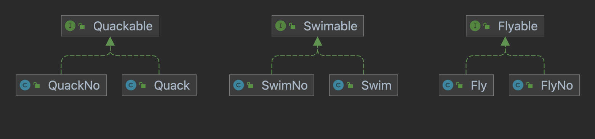

### 1.전략 패턴 (Stratey Pattern)
---


- 전략 패턴이란 ***행위를 정의하고 캡슐화해서 행위를 사용하는 대상이 각각의 알고리즘을 수정해서 쓸 수 있게 해주는 패턴***이다.
- 대상에 대한 행위를 직접 정의하는 것이 아닌 ***행위를 정의하고 그 행위를 할 대상에 구성***하게한다.
  - 프로그램 실행중에도 코드를 수정하지 않고 대상에 대한 행위를 변경할 수 있다는 장점이 있다.
> 캡슐화는 객체가 내부적으로 기능을 어떻게 구현하는지를 감추어 ***내부의 기능 구현이 변경되더라도 그 기능을 사용하는 코드는 영향을 받지 않도록 만들어 주는것***을 말한다.
  ```java
    //캡슐화가 되지 않은 코드
    public class Member{
        private String username;
        private boolean isDeleted;
    }

    //회원 삭제 기능을 추가할때 마다 MemberService의 코드를 변경해야한다.
    public class MemberService(){
        public void deleteMember(Member member){
            member.isDeleted = true;
        }
    }

    //캡슐화가 된 코드
    public class Member{
        private String username;
        private boolean isDeleted;
        public void deleteMember(){
            this.isDeleted = true;
        }
    }

    //회원 삭제 기능이 추가되어도 MemberService의 코드를 수정할 필요가 없다. (캡슐화의 강점)
    public class MemberService(){
        public void deleteMember(Member member){
            member.deleteMember();

        }
    }
  ```

### 2. 대상에 대한 행위를 직접 정의할 경우
---

- 여러 종류의 오리들을 구현해야한다는 요청사항이 들어왔다 가정해보자.
    - 나무 오리, 고무 오리, 진짜 오리 등등....
- 오리는 여러 행동들이 가능하다.
  - 날기, 수영하기, 울기 등등...

#### 2.1. 상속을 통한 대상에 대한 행위를 직접 정의
- `Duck`이라는 추상 클래스를 만든 이후 여러 종류의 오리를 구현해보자.
- `Duck`에는 미리 오리의 행위를 구현하고, 하위 클래스가 필요한 행위들을 재정의한다.  
    ```java
    /**
    * 오리의 추상 클래스
    */
    public abstract class Duck {

        public void quack() {
            System.out.println("울부짖다.");
        }

        public void fly() {
            System.out.println("난다.");
        }

        public void swim() {
            System.out.println("수영한다.");
        }

    }
    ```
- 오리 구현 클래스
    ```java
    //진짜 오리 울기(O), 날기(O), 수영(O)
    public class RealDuck extends Duck{
    }

    //고무오리 울기(X), 날기(X), 수영(O)
    public class RubberDuck extends Duck{
        @Override
        public void quack() {
            System.out.println("울부짖지 못한다.");
        }

        @Override
        public void fly() {
            System.out.println("날지 못한다.");
        }

    }

    //나무 오리 울기(X), 날기(X), 수영(X)
    public class WoodDuck extends Duck{
        @Override
        public void quack() {
            System.out.println("울부짖지 못한다.");
        }

        @Override
        public void fly() {
            System.out.println("날지 못한다.");
        }

        @Override
        public void swim() {
            System.out.println("수영을 못한다.");
        }
    }
    ```
- 실제 코드를 작성해보니 생각 보다 쉽게 여러 종류의 오리를 구현할 수 있어다.

#### 2.2  상속을 통한 대상에 대한 행위를 직접 정의할때 발생하는 문제점
- 새로운 오리를 만들었을 때, ***재정의를 재대로 하지 않으면 내가 원하지 않는 행동을 할 가능성이 높다.***
- 오리에 대한 ***새로운 행위를 추가할 경우, 하위 클래스들이 전부 영향을 받는 문제가 발생***한다.
  - 어떤 행위를 해야하는지 하지 말아야하는지 일일히 신경쓰면서 작성해야한다.
- 위의 예제에서 고무 오리와 나무 오리는 울지도 못하고 날지도 못하는 ***코드를 중복해서 작성***하고 있다.
  - 만약 중복된 코드를 수정해야할 때 전부 찾아가서 수정해야하는 문제점이 발생한다.

### 3. 전략패턴을 활용한 오리 만들기
---

- 대상에 대한 행위를 작성하게 될 경우 여러 문제점들이 발생할 수 있는 여러 문제점 때문에 이를 전략패턴을 활용하여 해결해보자.

#### 3.1. 행위(전략) 정의하기
- 먼저 행위를 정의하기 위해서 어떤 행위가 있는지 보자.
  - 난다, 울다, 수영하다
  - 하다, 하지 못한다.
- 행위에 대한 정의 구현

- 각 행위별 한다 하지 못한다를 인터페이스와 클래스로 먼저 구현해 보았다.

#### 3.2. 행위를 사용할 대상 클래스 정의하기
- 기존에 `Duck`이라는 클래스를 좀 수정해서 대상클래스를 만들어보자.
- 행위를 구성할 대상 클래스를
```java
public abstract class Duck {
    //행위 구성
    private Quackable quackable;
    private Flyable flyable;
    private Swimable swimable;

    //setter 메서드들을 통해서 언제든지 행위 변경 가능
    public void setQuackable(Quackable quackable) {
        this.quackable = quackable;
    }

    public void setFlyable(Flyable flyable) {
        this.flyable = flyable;
    }

    public void setSwimable(Swimable swimable) {
        this.swimable = swimable;
    }

    //행위들
    public void quack() {
        quackable.quack();
    }

    public void fly() {
        flyable.fly();
    }

    public void swim() {
        swimable.swim();
    }

}
```

- 오리를 구현한 구현 클래스들
```java
//진짜 오리 울기(O), 날기(O), 수영(O)
public class RealDuck extends Duck {
    public RealDuck() {
        super.setQuackable(new Quack());
        super.setFlyable(new Fly());
        super.setSwimable(new Swim());
    }
}

//고무오리 울기(X), 날기(X), 수영(O)
public class RubberDuck extends Duck {
    public RubberDuck() {
        super.setQuackable(new Quack());
        super.setFlyable(new FlyNo());
        super.setSwimable(new SwimNo());
    }
}

//나무 오리 울기(X), 날기(X), 수영(X)
public class WoodDuck extends Duck {
    public WoodDuck() {
        super.setQuackable(new QuackNo());
        super.setFlyable(new FlyNo());
        super.setSwimable(new SwimNo());
    }
}
```

### 4. 전략 패턴으로 구현한 오리프로그램 실행해보며 생각해보기
---

```java
System.out.println("========진짜 오리========");
Duck realDuck = new RealDuck();
realDuck.fly();
realDuck.swim();
realDuck.quack();

System.out.println();
System.out.println("========고무 오리========");
Duck rubberDuck = new RubberDuck();
rubberDuck.fly();
rubberDuck.swim();
rubberDuck.quack();

System.out.println();
System.out.println("========나무 오리========");
Duck woodDuck = new WoodDuck();
woodDuck.fly();
woodDuck.swim();
woodDuck.quack();
```

#### 4.1. 전략패턴에 대해 생각해보기
- 전략 패턴 장점
  - ***행동을 동적으로 변경할 수 있는 장점***이 있다.
  - ***코드 중복이 사라졌으며 재사용성이 증가***했다.
  - 구성을 통해서 코드를 작성하게 되면 ***테스트 코드 작성이 좀 더 쉬워진다.***
  - 단일 책임 원칙을 지켜가며 ***해당 클래스가 어떤 역할을 하는 클래스인지 명확***해졌다.
  - 상위 클래스에 대한 재정의가 아닌 ***행위를 구성***만 하면된다.
    - 새로운 행위가 추가되어도 `Duck`의 하위 클래스는 구성만 제대로 하면된다.
> 전략 패턴의 가장 큰 핵심은 대상은 행위 라는 인터페이스 또는 클래스를 구성하는 것에 있다.

- 전략 패턴 활용 시 생각해봐야할 것
  - 모든 행위들을 전략 패턴을 활용하여 구성하면 매우 유연한 코드가 될 수 는 있지만, 해당 클래스를 사용하는 사람의 입장에서 생각보다 복잡하게 구성되어 있다고 느낄 수 있다.
  - 때문에 우리는 항상 어디까지 전략 패턴을 활용할지 언제는 활용하지 말아야할지를 코드 작성하면서 항상 고려해야한다.
    - 내가 이렇게 개발한 이유에 대한 타당성이 필요
  - 왜냐하면 내가 개발한 코드를 항상 내가 개발하지 않고 다른 사람이 개발 할 수도 있기 때문이다.
  - 하나의 행위밖에 하지 않고 코드가 중복되지도 않는 상황에서도 전략패턴을 활용하여 구성한다면 이는 타당성이 없는 코드이다. 너무 많은 확장성을 고려하여 코드를 작성하지마라.
  - 만약 변화에 대한 상황이 온다면, 그 전에 미리 테스트 코드 작성과 변화를 위해 기존 코드를 어떤식으로 변경(리팩토링)할지에 대한 방법론을 좀 더 고려해보는 것도 좋은 방법 중에 하나이다.

